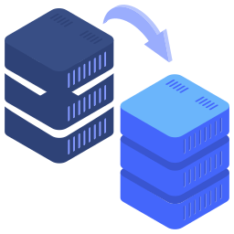

# Federation

[](https://github.com/nanernunes/federation/actions/workflows/go.yml)
[](https://github.com/nanernunes/federation/releases/latest)
[](https://godoc.org/github.com/nanernunes/federation)
[](../LICENSE.md)
[](https://github.com/nanernunes/federation)
[](https://codecov.io/gh/nanernunes/federation)

Federation is a between broker forwarder. It forwards messages between topics by subscribing them at a side and then the messages are handled (payload, header) towards to a target keeping at least some compatibility layer.



Highlights include:

- **Static Federation** - through environment variables
- **AMQP (RabbitMQ)** - only as a source Broker
- **AWS SNS** - only as a target Broker


### What it is not

Even the feature to forward messages between sources and targets of the same protocol (eg.: AMQP -> AMQP), this tool doesn't try to replace the original federation feature embedded on those brokers. Don't use the project this way.

### How it works
With this first version, we only allowed mapping from AMQP (RabbitMQ) clients to SNS brokers. For each federation mapping we create a new AMQP queue with the suffix `federation` that consumes the messages (with an exchange of the same name) and forward them to the target.

### Next releases
- We plan to allow mappings in both directions **AMQP->SNS** and **SNS->AMQP**, as well as the support of new protocols (eg.: Kafka, Redis, etc)
- A web interface and API with the immutable static method and the dynamic ones we could create in real-time (stored in a database)


## Getting Started
Building the Application
```ini
make build
```

Running the Application (in developer mode)
```ini
DEBUG=1 make run
```

Running the Application (in production mode)
```ini
docker run -d nanernunes/federation
```


### Declaring Backends by Environment Variables
A backend is made up of three parts, the protocol name (AMQP, SNS, etc), an identifier (single word) and its properties (HOST, PORT, ...)
```ini
PROTOCOL_IDENTIFIER_PROPERTY=value
```

### Declaring an AMQP Backend
```ini
AMQP_MYORIGIN_HOST=localhost
AMQP_MYORIGIN_PORT=5672
AMQP_MYORIGIN_VHOST=/
AMQP_MYORIGIN_USER=guest
AMQP_MYORIGIN_PASS=guest
```

### Declaring a SNS Backend
```ini
SNS_MYTARGET_REGION=us-east-1
```

> When we define only the region, federation uses the current AWS IAM Role or the configured credentials in `~/.aws/credentials`. It's possible to define AWS Keys to override this behavior
```ini
SNS_MYTARGET_AWS_ACCESS_KEY_ID=XXXXXXXXXXX
SNS_MYTARGET_AWS_SECRET_ACCESS_KEY=ZZZZZZZZZZZZZZZZZZZZZZ
```

### Declaring Federations
With at least two (2) backends it's time to declare federations so our messages can flow through the brokers.
This declaration pushes all messages from the topic (MYORIGIN) `helloworld` towards the topic at (MYTARGET) `helloworld`
```ini
FEDERATION_EXAMPLE_1=MYTARGET_helloworld,MYORIGIN_helloworld
```


## License

[MIT](LICENSE.md)

